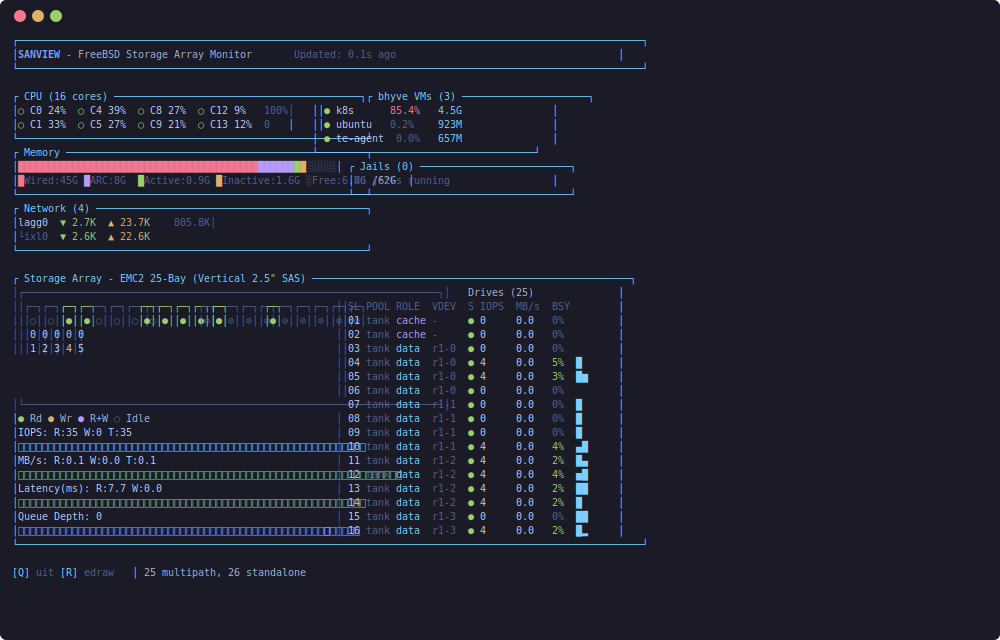

# SANVIEW

Real-time TUI for monitoring FreeBSD storage arrays.



SANVIEW provides a visual front panel representation of a storage enclosure with real-time activity LEDs, alongside system metrics like CPU, memory, network, and virtualization status. Built specifically for FreeBSD systems using multipath storage with external SAS/SATA drive enclosures.

**Note:** This tool is currently tailored for a specific hardware configuration - a 25-bay EMC2 chassis with dual-controller multipath and ZFS. Adapting it to other enclosure types would require modifications to the SES slot mapping and front panel layout.

## Building

```bash
cargo build --release
sudo ./target/release/sanview
```

The `-r` flag adjusts refresh rate in milliseconds (default 250ms, range 50-10000).

## What it shows

The display is split into system overview (top) and storage array (bottom):

**System Overview**
- Per-core CPU utilization with aggregate sparkline
- Memory breakdown: wired, ZFS ARC, active, inactive, free
- Network interface throughput
- bhyve VMs and jails with resource usage

**Storage Array**
- Visual front panel with 25 drive slots
- Activity LEDs showing read/write/idle state per disk
- Dual-controller indicators (active vs passive path)
- Per-drive statistics: pool, vdev role, IOPS, bandwidth, latency, busy%
- Cumulative I/O sparklines (IOPS, MB/s, latency, queue depth)

## How it works

Data comes from several FreeBSD-specific sources:
- **libgeom** for disk I/O statistics
- **gmultipath** for path topology and active/passive state
- **SES ioctls** for physical slot mapping in the enclosure
- **zpool status** for pool/vdev membership
- **sysctl** for CPU, memory, network stats
- **kinfo_proc** for bhyve VM enumeration

The architecture uses two threads - the main thread runs all collectors (required for libgeom's FFI), while a UI thread renders via ratatui and polls shared state.

## Requirements

- FreeBSD 14.x
- Root privileges (GEOM stats and SES ioctls need it)
- Terminal with Unicode support (box drawing, braille characters for sparklines)

## LED Legend

```
●  green    - read activity
●  yellow   - write activity
●  magenta  - read+write
○  gray     - idle
⊘  dim      - passive/standby path
```

## License

MIT
